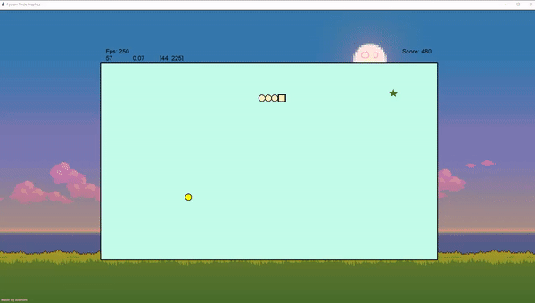
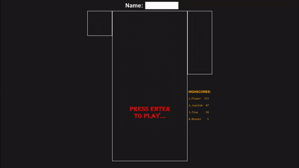
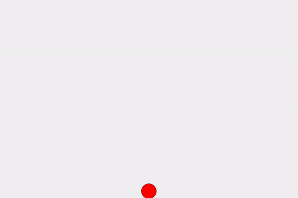

# Python Projects
My different python projects, starting from 2nd semester (autumn 2020) into the computer technology bachelor. Most of the projects was made on my spare time while learning python.

### Snake

Made at the very start of 2nd semester, almost without functions and objects. This was my first big project. Used turtle graphics.

### Tetris

This is probably the project I'm most satisfied by. I made this at the end of the 2nd semester.

### Ball

Made at the end of 2nd semester. Added realistic physics to the balls.

